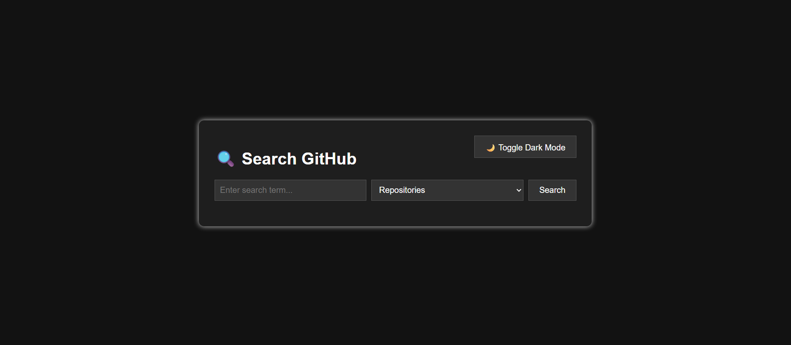

# 🔍 GitHub Project Search App

A simple web application to search for **GitHub repositories**, **users**, or **commits** using the GitHub API. Built with **HTML**, **CSS**, and **JavaScript**, it supports authentication, pagination, and dark mode.

## ✨ Features

- 🔎 Search by:
  - Repositories
  - Users (accounts)
  - Commits
- 🔁 Pagination controls
- 🌙 Dark mode toggle
- 🔐 GitHub token support (for increased rate limit)
- ⚡ Clean and responsive UI

## 🚀 Live Demo

👉 [Click here to try it live](https://rafaaa4.github.io/Github-Search/)

## 📸 Preview


## 🔧 How to Use

1. **Clone or download this repository**

```bash
git clone https://github.com/rafaaa4/github-search.git
cd github-search-app
